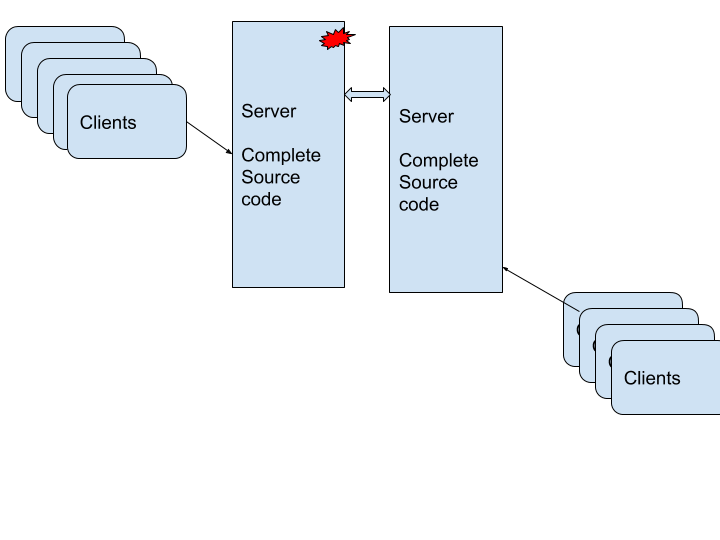
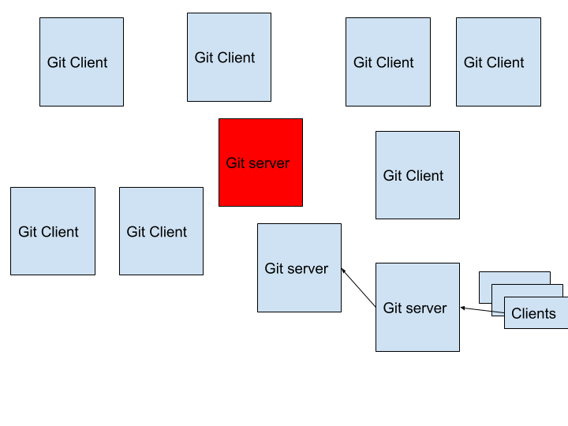
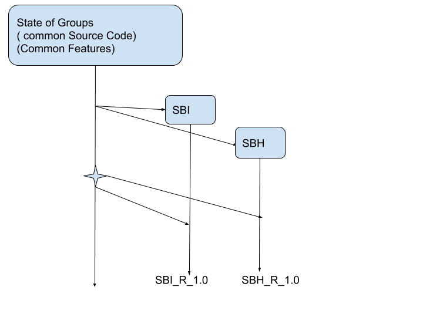
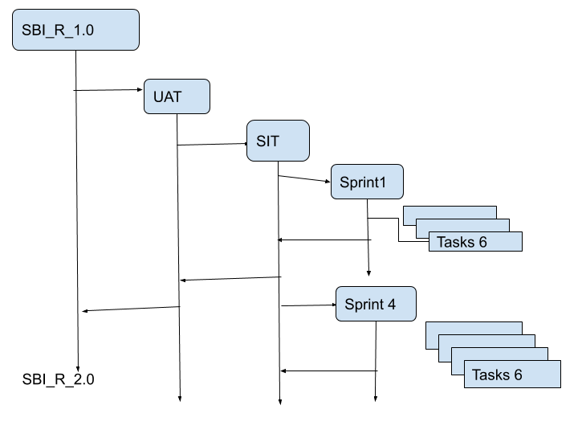

# CICD
*  Version Control       :   GIT
*  Build Tool                :   Maven
*  CI  tool                    :   Jenkins
*  CD                          :   Jfrog (Artifacts/Wars/ Release)
*  Code Analyser        :    SonarQube

# Version control are two types:
 * 1) Client and server Art
 * 2) Distributed Art

###  Client and server Art


### Distributed Art



### By using version control:

* We can able to create  versions for every change
* We can able to go back to older version any point
* We can able to auto merge( if it is possible)
* We can able to create branches.

```
Staging Area : git add -A
Local Repo   : git commit -m “comment”
Remote Repo: www.github.com( git push)

```

## Git Branches are Two types:
* 1) Customer Branch
* 2) Release Branch.


### Customer Branch



### Release Branch




```
Create Git repo:

echo "# mySBI_APP" >> README.md
git init
git add README.md
git commit -m "first commit"
git remote add origin https://github.com/vtvc/mySBI_APP.git
git push -u origin master

Create Branches:
  git checkout -b  <branch Name>

switch branches :
   git checkout <branch name>

Merge branches
   git merge <branch name>

Tag:
  git tag  <release name>

For Delete remote Branch and Tags
   git push -d <remote_name> <branch_name or tag name>

For Delete remote Branch and Tag
  git branch -d <branch_name or tag name>   : Normal delete
  git branch -D <branch_name or tag name>   : Force Delete


    

```


